# Programming Assignment 01 - Using command-line utilities for network debugging
## Assignment Report - Saksham Singh (2022434)
- CSE232 Computer Networks Assignment

### 1. `ifconfig` command
#### 1.a Learn to use the ifconfig command, and figure out the IP address of your network interface. Put a screenshot.
- The `ifconfig` command displays all the network interfaces of the device and allows us to configure their parameters
- using `ifconfig` on device outputs the following:
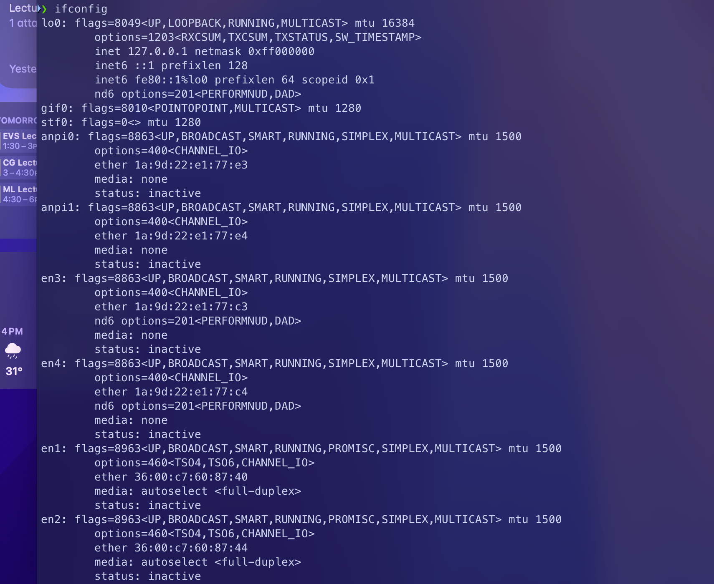

these all are the network interfaces on my device
- `en0` is the primary WiFi interface of the device, which can be cross-checked from macbook's own internal settings like follows:
 The red-rectangle of the above image shows the `ipv4` address of the `en0` network interface, which is `192.168.42.154`. (note that the hardware address don't match, as by default macOS randomises the mac address for every WiFi network.) This again can be cross-checked by internal setting of macbook as follows: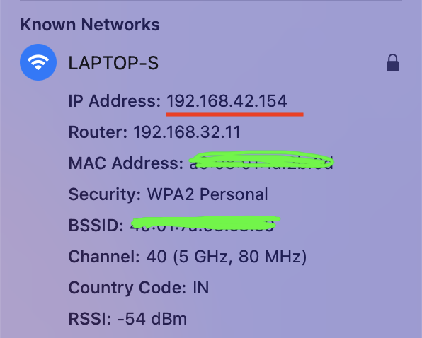
- some other interfaces that we can see are `lo0` which is the loopback interface, `en1` which is the Thunderbolt 1 interface, `en2` which is the Thunderbolt 2 interface, `en3` which is the Ethernet interface, `bridge0` which is the thunderbolt bridge, and many more.

#### 1.b Go to the webpage `https://www.whatismyip.com` and find out what IP is shown for your machine. Are they identical or different? Why?
Below is the public IP address of my device as shown on the website `https://www.whatismyip.com`:

As we can see, the IP address - `103.25.231.125` is different from the IP address of the `en0` network interface - `192.168.42.154`. This is because the `en0` network interface is a private IP address, which is assigned by the router to the device on the local network. The public IP address is the address of the router, which is assigned by the ISP. The router then assigns private IP addresses to the devices on the local network. The public IP address is used to identify the device on the internet, while the private IP address is used to identify the device on the local network. This translation is explained by a process called **NAT - Network Address Translation**.

### 2. `ifconfig` continued
#### 2.a Change the IP address of your network interface using the command line. Put a screenshot that shows the change. Revert to the original IP address.
- To change the IP address of any interface, it can be done simply using 
  ```bash
  sudo ifconfig <interface_name> <new_ip_addr>
  ```
  where `<interface_name>` is the name of the interface whose IP address is to be changed, and `<new_ip_addr>` is the new IP address to be assigned to the interface.
- so for my device to a random IP address, let's say - `192.168.100.100`, I have to do
  ```bash
  sudo ifconfig en0 192.168.100.100
  ```
  which can be verified by using `ifconfig en0` command
  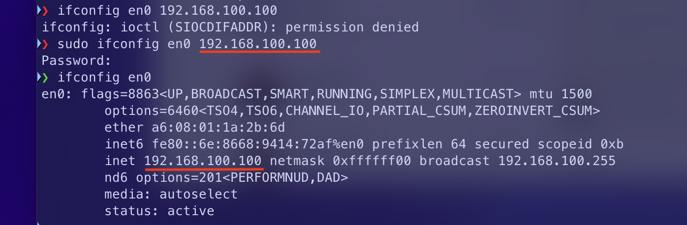
- to revert back to the original IP address, I can simply do
  ```bash
  sudo ifconfig en0 192.168.42.154
  ```
  

### 3. `netcat` command
#### 3.a Use “netcat” to set up a TCP client/server connection between your VM and host machine. If you are not using a VM, you can set up the connection with localhost. Put a screenshot.
- using `netcat` command involves running the `nc` command in two terminals, one acting as the server and the other as the client.
- since I don't have access to a VM, I will be setting up the connection between my host machine and localhost by running the server on my host machine and the client on localhost, by using two different terminals.
- the server can be started on the host machine by running the command
  ```bash
  nc -l <port_num>
  ```
    where `<port_num>` is the port number on which the server will listen for incoming connections. 
- the client can be started on the localhost by running the command
  ```bash
  nc -v <host_ip> <port_num>
  ```
    where `<host_ip>` is the IP address of the host machine, and `<port_num>` is the port number on which the server is listening, here the `host_ip` will be `127.0.0.1` (localhost).
    
- the connection is established between the server and the client, and the client can send messages to the server, which will be displayed on the server terminal. 
  - ##### sending a message from the client to the server
    
  - ##### receiving the message on the server
    
  - ##### sending a message from the server to the client
    
  - ##### receiving the message on the client
    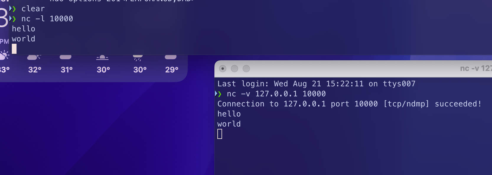
- the connection can be closed by pressing `Ctrl+C` on the server terminal. 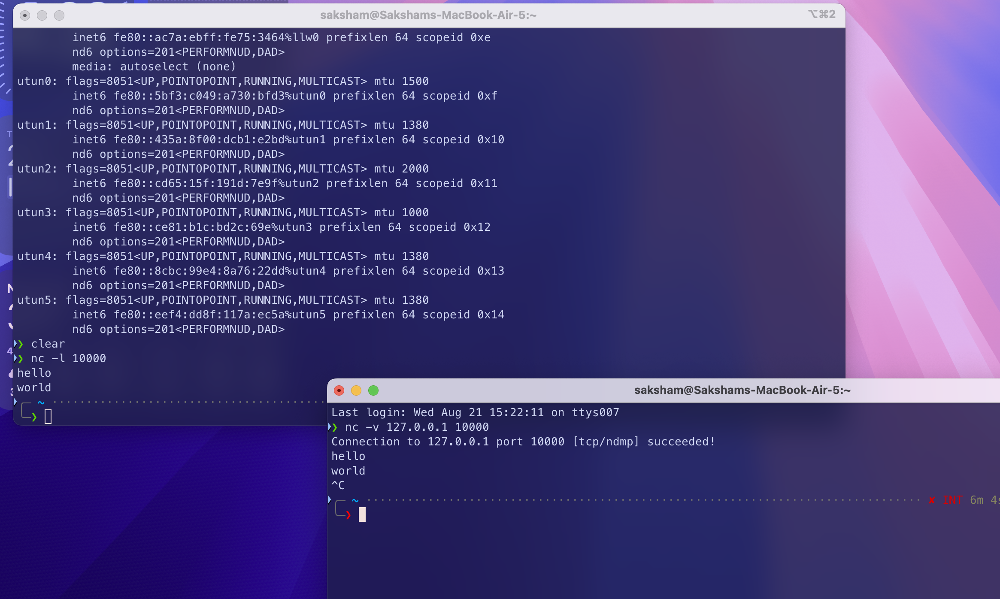

#### 3.b Determine the state of this TCP connection(s) at the client node. Put a screenshot.
- the state of the TCP connection can be determined by using the option `-z` with the `nc` command, which will scan the port for listening services. Using this command won't establish a connection, but it will show the state of the connection.
  ```bash
  nc -zv <host_ip> <port_num>
  ```
    where `<host_ip>` is the IP address of the host machine, and `<port_num>` is the port number on which the server is listening. 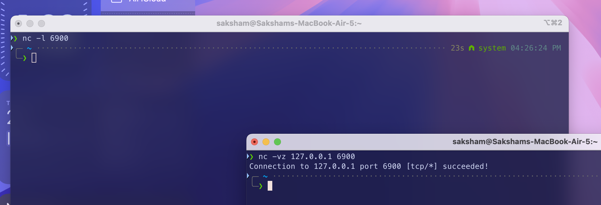
    the message on client terminal shows that the connection is established and the port is open.
- if no listening service found, it will show an error message, which can be because the server is not running or the port number is incorrect. 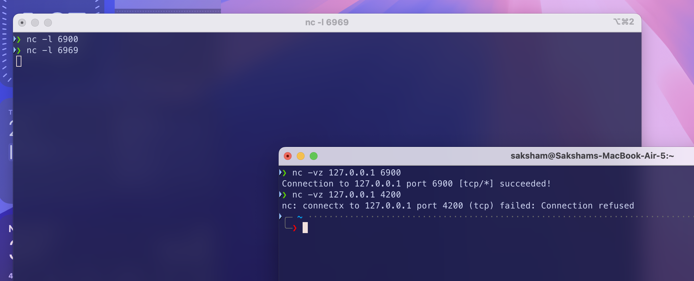
  

### 4. `nslookup` command
#### 4.a Get an authoritative result for “google.in” using `nslookup`. Put a screenshot. Explain how you did it.
- `nslookup` is a command-line tool used to query the Domain Name System (DNS) to obtain domain name or IP address mapping, or other DNS records.
- generally, the `nslookup` command is used as follows:
  ```bash
  nslookup <domain_name>
  ```
    where `<domain_name>` is the domain name for which the DNS records are to be queried. It returns the closest DNS server and its socket address, and returns the non-authoritative IP address of the domain entered. This non-authoritative IP address is the IP address of the DNS server that resolved the domain name, not necessarily the IP address of the domain itself.
    
- to get the authoritative result for a domain, we need to first find the DNS server of the domain, and then query that DNS server for the domain name. This can be done by using the option `-type=ns` with the `nslookup` command, which will return the authoritative DNS server for the domain.
  ```bash
  nslookup -type=ns <domain_name>
  ```
    where `<domain_name>` is the domain name for which the authoritative DNS server is to be found. 
    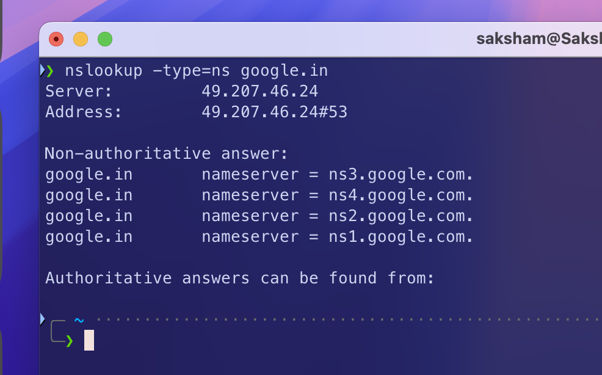
    Now, we can use one of these DNS servers to query the domain name and get the authoritative result, by following the `domain_name` with the DNS server domain.
    ```bash
    nslookup <domain_name> <dns_server>
    ```
    where `<domain_name>` is the domain name for which the DNS records are to be queried, and `<dns_server>` is the authoritative DNS server for the domain. 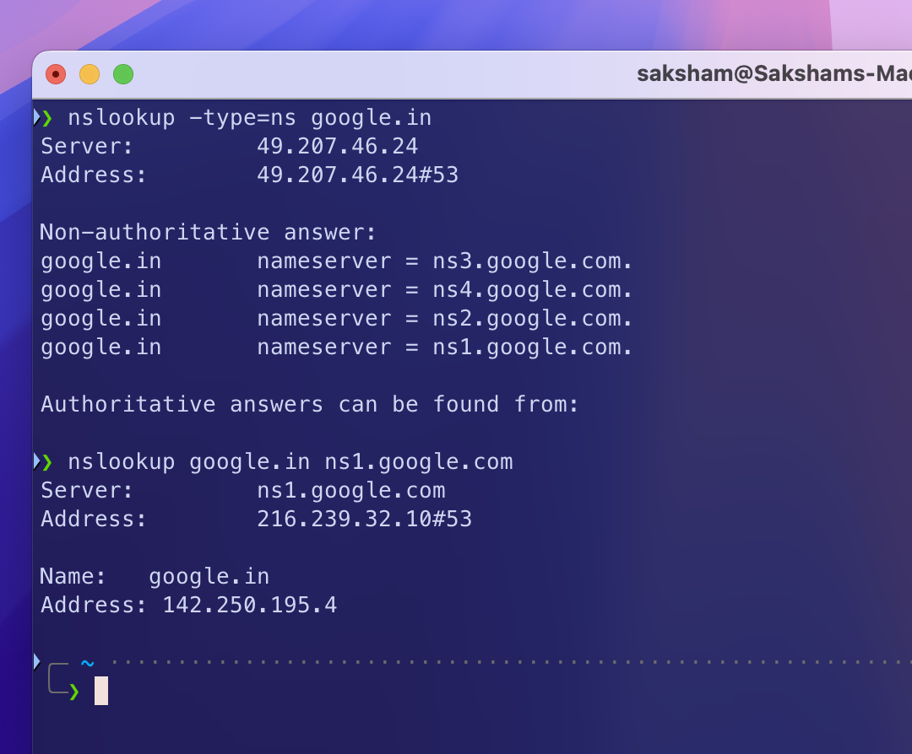
    here we can see that the authoritative result for the domain `google.in` is `142.250.195.4`.

#### 4.b Find out the time to live for any website on the local DNS. Put a screenshot. Explain in words (with unit) after how much time this entry would expire from the local DNS server.
- the time to live (TTL) is a value in a DNS record that determines the lifespan of the record in the cache of the DNS server. It is measured in seconds.
- the same can be found using the `debug` option in the `nslookup` command:
  ```bash
    nslookup -debug <domain_name>
  ```
    where `<domain_name>` is the domain name for which the DNS records are to be queried. 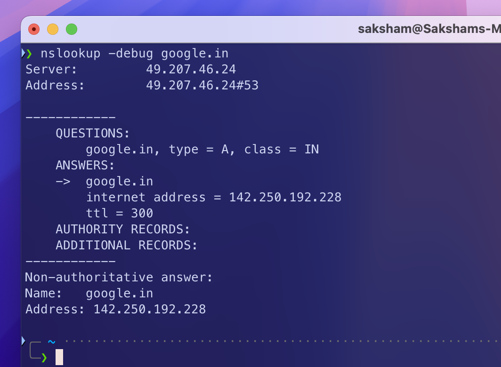
    here we can see that the TTL for the domain `google.in` is `300` seconds, which means that the DNS record will expire from the local DNS server after `300` seconds, or `5` minutes.
    for `iiitd.ac.in`, the TTL is `86400` seconds, which means that the DNS record will expire from the local DNS server after `86400` seconds, or `1` day.
    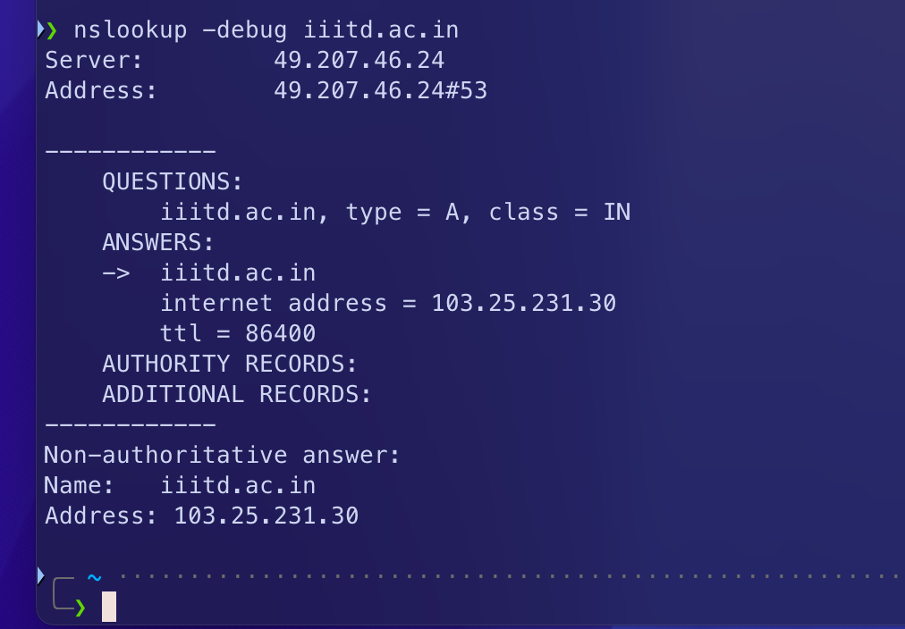

### 5. `traceroute` and `ping` commands
#### 5.a Run the command, `traceroute google.in`. How many intermediate hosts do you see? What are the IP addresses? Compute the average latency to each intermediate host. Put a screenshot.
- `traceroute` is a command-line tool that tracks the route packets take from one host to another over an IP network. It shows the IP addresses of the intermediate hosts and the latency to each host (the command displays three latency values for each host, for three attempts at making connection, taking average of these values can give the average latency for the jump).
  ```bash
  traceroute google.in
  ```
  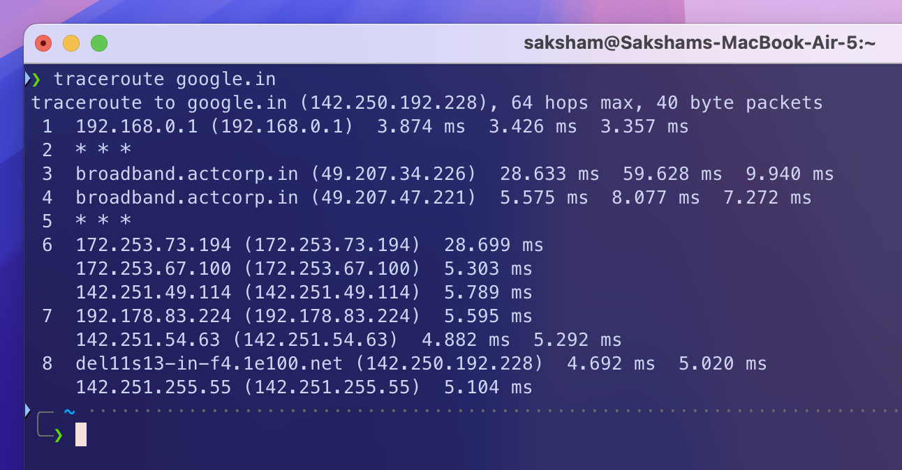
- the ip addresses of the intermediate hosts are as follows:
  ```
  Jump 1: 192.168.0.1 (local router)
     avg latency: 3.552 ms
  Jump 2: ----redacted----
  Jump 3: 49.207.34.226 (broadband.actcorp.in - ACT Fibernet ISP)
     avg latency: 32.734 ms
  Jump 4: 49.207.47.221 (broadband.actcorp.in - ACT Fibernet ISP)
     avg latency: 6.975 ms
  Jump 5: ----redacted----
  Jump 6: 172.253.73.194 or 172.253.67.100 or 142.251.49.114
     avg latency: 13.264 ms
  Jump 7: 192.178.83.224 or 142.251.54.63
     avg latency: 5.256 ms
  Jump 8: 142.250.192.228 (google.in) or 142.251.255.55
     avg latency: 4.939 ms
  ----------------------------------------------
  Total hops: 8
  Total latency: 66.720 ms
  ```
#### 5.b Send 50 ping messages to `google.in`, Determine the average latency. Put a screenshot.
- `ping` command is used to check the connectivity between two devices and to measure the round-trip time for the packets to reach the destination and come back.
- any domain or IP address can be pinged by
  ```bash
  ping <domain_name/ip_addr>            # or
  ping -c <count> <domain_name/ip_addr> # for a specific count of packets
  ```
    where `<domain_name/ip_addr>` is the domain name or IP address of the host to be pinged, and `<count>` is the number of packets to be sent.
    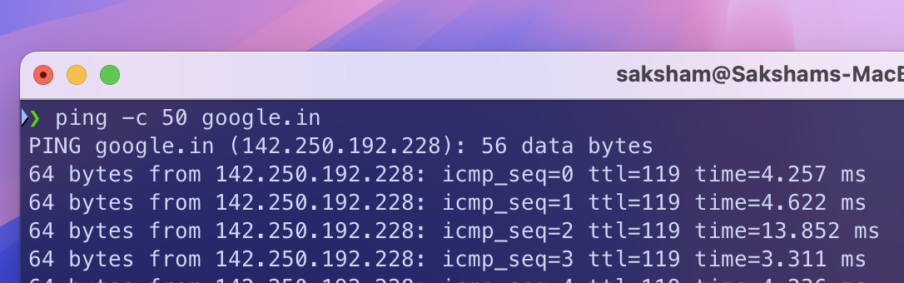
    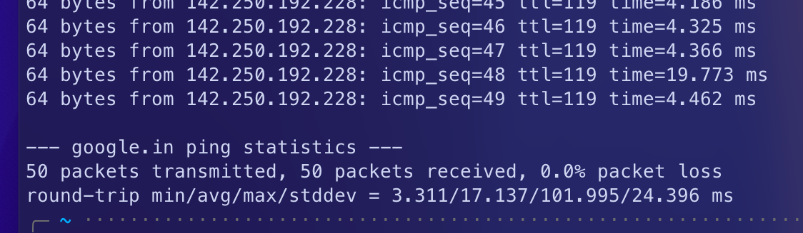
- the average latency for the 50 packets sent to `google.in` is `17.137 ms`.

#### 5.c Add up the ping latency of all the intermediate hosts obtained in (a) and compare with (b). Are they matching, explain?
- the total latency of the intermediate hosts obtained in (a) is `66.720 ms`, and the average latency of the 50 packets sent to `google.in` is `17.137 ms`.
- this change in latencies can be explained by two reasons, which are as follows:
  - **smaller amount of packets sent** : the `ping` command sends 50 packets, which is much larger than the number of packets sent by the `traceroute` command, which sends only 3 packets. The average latency of the `ping` command is calculated over a larger number of packets, which gives a more accurate representation of the latency. The `traceroute` command, on the other hand, sends only 3 packets, which may not be representative of the actual latency. This is also seen in the `stddev` in `ping` command, which is `24.396 ms`, which is quite large, indicating that the latency values are spread out over a large range.
  - **inconsitencies in the network** : the latency values obtained by the `traceroute` command are the average of the three attempts made to connect to the host. These values may vary due to network congestion, packet loss, or other factors. The latency values obtained by the `ping` command are the round-trip time for each packet, which may also vary due to network conditions. These inconsistencies in the network can cause the latency values obtained by the two commands to be different.

#### 5.d Take the maximum ping latency amongst the intermediate hosts (in (a)) and compare it with (b). Are they matching, explain?
- the maximum latency of the intermediate hosts obtained in (a) is `32.734 ms`, and the average latency of the 50 packets sent to `google.in` is `17.137 ms`.
- the maximum latency of the intermediate hosts is higher than the average latency of the `ping` command, which can be explained by:
  - **network congestion** : the maximum latency of the intermediate hosts is the maximum latency observed during the three attempts made by the `traceroute` command. This maximum latency may be due to network congestion, packet loss, or other factors that cause delays in the network. The average latency of the `ping` command, on the other hand, is the average round-trip time for each packet, which smoothens out the effects of network congestion and other factors.

#### 5.e You may see multiple entries for a single hop while using the `traceroute` command. What do these entries mean?
- the multiple entries for a single hop in the `traceroute` command indicate that there are multiple paths to reach the destination host. At every point in the network, a router may route it to a different path with a different latency, which are all affected by the network conditions like congestion, faults etc. across the network. This path may change for every packet sent, which is why the latency values may vary for each attempt made by the `traceroute` command. 

#### 5.f Send 50 ping messages to `stanford.edu`, Determine the average latency. Put a screenshot.
- the average latency for the 50 packets sent to `stanford.edu` is `313.095 ms`.
  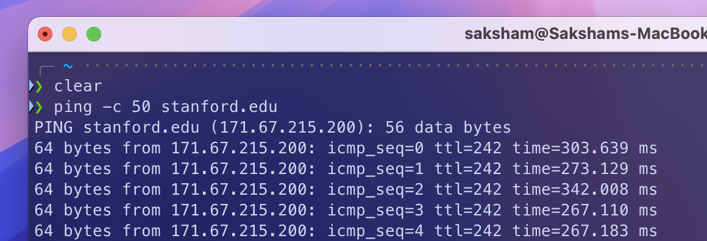
  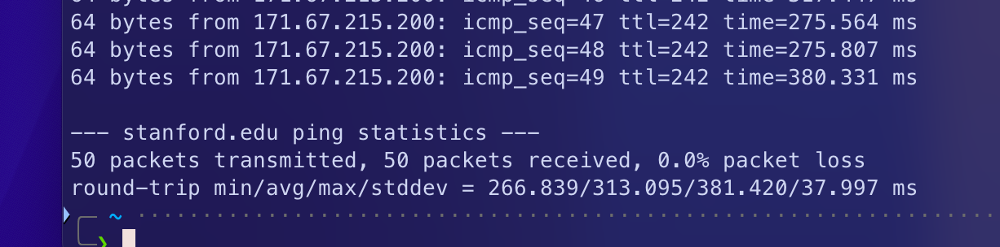

#### 5.g Run the command, `traceroute stanford.edu`. Compare the number of hops between `google.in` and `stanford.edu` (between the traceroute result of `google.in` and `stanford.edu`)
- 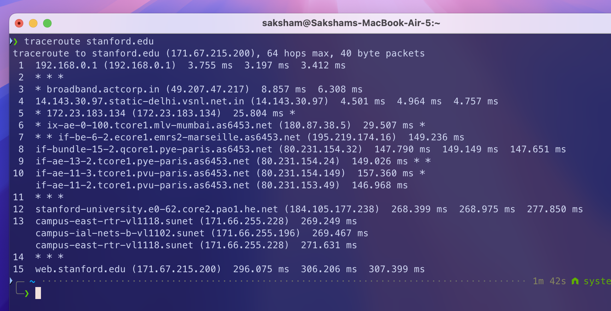
  ```
  google.in: 8 hops
  stanford.edu: 15 hops
  ```
  the number of hops between `stanford.edu` and `google.in` is `7` hops, which is quite a significant difference (nearly as much as the number of hops to `google.in`).

#### Can you explain the reason for the latency difference between google.in and stanford.edu (see (b) & (f))?
- the latency difference between `google.in` and `stanford.edu` can be explained by the following reasons:
  - **geographical distance** : the physical distance between the source and destination hosts can affect the latency of the packets. `google.in` is a domain hosted in India, while `stanford.edu` is a domain hosted in the United States. The packets have to travel a longer distance to reach `stanford.edu`, which can increase the latency.
  - **number of intermediate hosts** : the number of intermediate hosts between the source and destination hosts can also affect the latency. `stanford.edu` has more intermediate hosts than `google.in`, which can increase the latency as the packets have to pass through more routers and networks.

### 6.  Make your ping command fail for 127.0.0.1 (with 100% packet loss). Explain how you do it. Put a screenshot that it failed.
- `127.0.0.1` is the IP address associated with the loopback interface (`lo0` on my device), which is used to test the network stack of the device, hence it is also known as the `localhost`.
  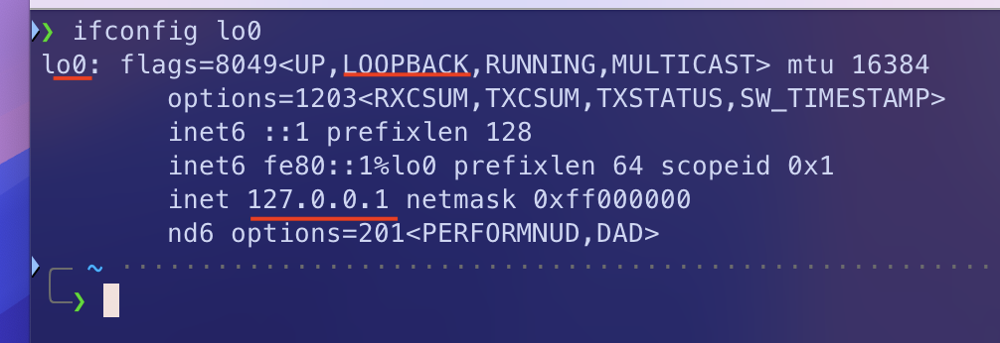 
- Normally whenever we ping to `127.0.0.1` it will always connect with very less latency,
  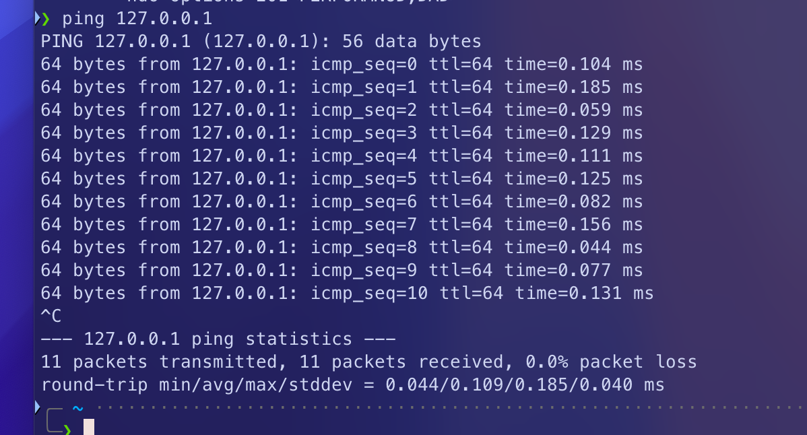 
- but we can make it fail by **changing the address of `lo0` interface**.
  ```bash
  sudo ifconfig lo0 <random_ip>
  ```
  this will change the IP address of the loopback interface as follows
  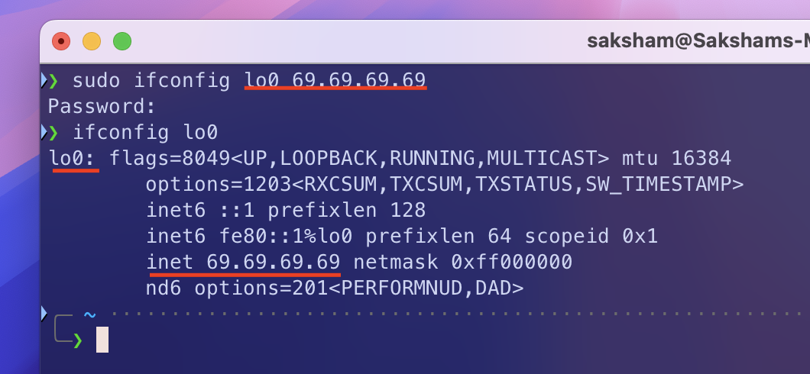
- now when we ping to `127.0.0.1`, it will fail with 100% packet loss
  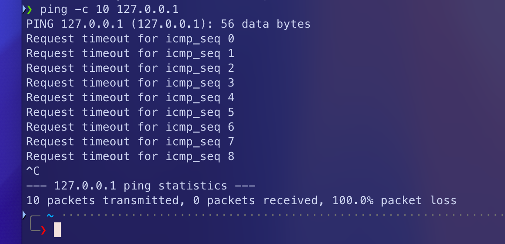
- to revert back to the original IP address, I can simply do
  ```bash
  sudo ifconfig lo0 127.0.0.1
  ping -c 10 127.0.0.1      # pinging again, it will work as it did before
  ```
    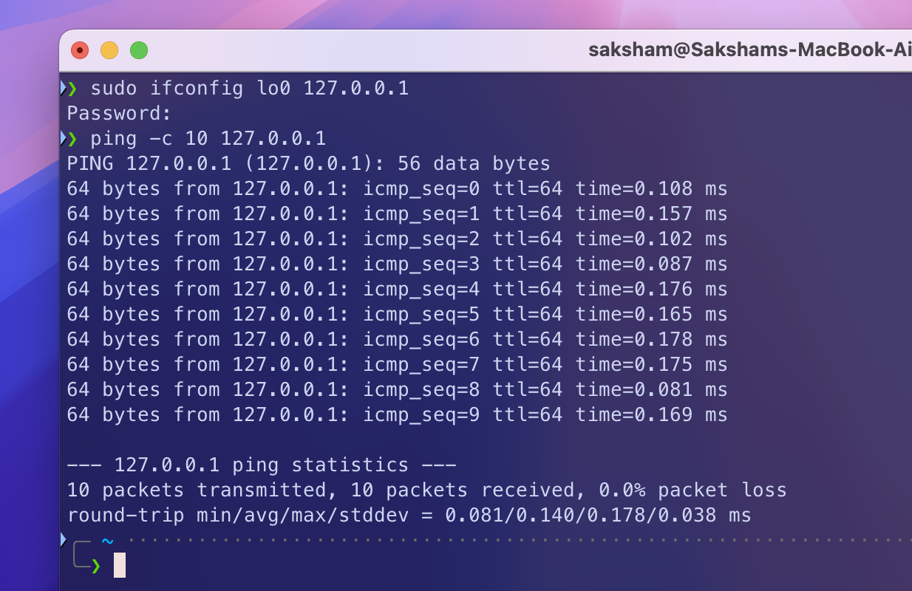


```
Thanks
- Saksham Singh
- CSE 2022434
- IIIT-Delhi
- August 2024
```