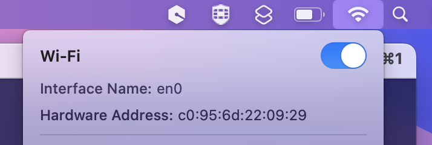
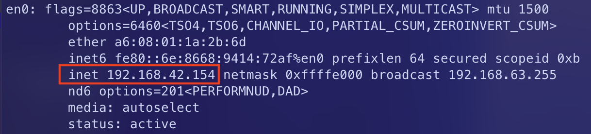
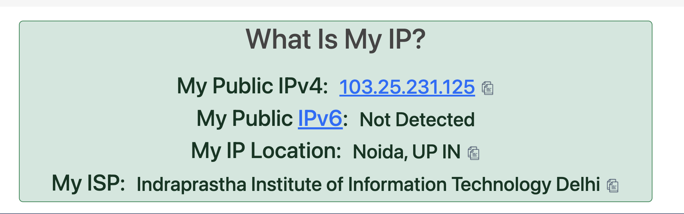

# Programming Assignment 01 - Using command-line utilities for network debugging
## Assignment Report - Saksham Singh (2022434)
- CSE232 Computer Networks Assignment

### 1. `ifconfig` command
#### 1.a Learn to use the ifconfig command, and figure out the IP address of your network interface. Put a screenshot.
- The `ifconfig` command displays all the network interfaces of the device and allows us to configure their parameters
- using `ifconfig` on device outputs the following:


these all are the network interfaces on my device
- `en0` is the primary WiFi interface of the device, which can be cross-checked from macbook's own internal settings like follows:
 The red-rectangle of the above image shows the `ipv4` address of the `en0` network interface, which is `192.168.42.154`. (note that the hardware address don't match, as by default macOS randomises the mac address for every WiFi network.) This again can be cross-checked by internal setting of macbook as follows:
- some other interfaces that we can see are `lo0` which is the loopback interface, `en1` which is the Thunderbolt 1 interface, `en2` which is the Thunderbolt 2 interface, `en3` which is the Ethernet interface, `bridge0` which is the thunderbolt bridge, and many more.

#### 1.b Go to the webpage `https://www.whatismyip.com` and find out what IP is shown for your machine. Are they identical or different? Why?
Below is the public IP address of my device as shown on the website `https://www.whatismyip.com`:

As we can see, the IP address - `103.25.231.125` is different from the IP address of the `en0` network interface - `192.168.42.154`. This is because the `en0` network interface is a private IP address, which is assigned by the router to the device on the local network. The public IP address is the address of the router, which is assigned by the ISP. The router then assigns private IP addresses to the devices on the local network. The public IP address is used to identify the device on the internet, while the private IP address is used to identify the device on the local network. This translation is explained by a process called **NAT - Network Address Translation**.

### 2. `ifconfig` continued
#### 2.a Change the IP address of your network interface using the command line. Put a screenshot that shows the change. Revert to the original IP address.
- To change the IP address of any interface, it can be done simply using 
  ```bash
  sudo ifconfig <interface_name> <new_ip_addr>
  ```
  where `<interface_name>` is the name of the interface whose IP address is to be changed, and `<new_ip_addr>` is the new IP address to be assigned to the interface.
- so for my device to a random IP address, let's say - `192.168.100.100`, I have to do
  ```bash
  sudo ifconfig en0 192.168.100.100
  ```
  which can be verified by using `ifconfig en0` command
  
- to revert back to the original IP address, I can simply do
  ```bash
  sudo ifconfig en0 192.168.42.154
  ```
  
