<h1 align="center">Using Linux IPTables
</h1>
<p align="center">
  Saksham Singh
  <br>
  2022434
  <br>
  CSE 232 - Computer Networks - PA03
</p>


## Q1 - Setting up the VMs and Port Forwarding
### Deliverables
Set up four VMs as shown in the figure. Use the same setup for the entire assignment.
- a) Configure the IP addresses and routes for all VMs, as shown in the figure
  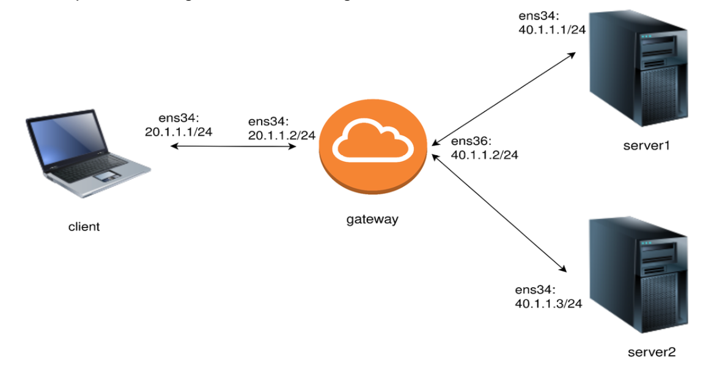
- b)  Configure VM2 as the gateway such that it can forward the incoming traffic to one of the servers – add forwarding functionality

### Methodology
- I have created 4 VMs using VirtualBox and installed Ubuntu 20.04 on all of them.
- I have configured the IP addresses and routes for all VMs as shown in the figure using VirtualBox's network settings for adding a NAT network. (as shown in the image above), and then configured the IP addresses and routes using the following commands:
  ```bash
  sudo nano /etc/netplan/01-netcfg.yaml
  ```
  then added the following configuration:
  ```yaml
    network:
        version: 2
        renderer: networkd
        ethernets:
        [port name]:
            match:
                macaddress: [mac address]
            set-name: [new port name]
            addresses:
            - [IP address]/[subnet mask]
            gateway4: [gateway IP]
            dhcp4: false
            routes:
            - to: [destination network addr]/[subnet mask]
                via: [gateway IP]
    ```
    then applied the changes using the following command:
    ```bash
    sudo netplan apply
    ```

- Using the above method, I have configured the IP addresses and routes for all the VMs and interfaces as shown in the figure. This way the configurations and routes persist even after a reboot.
- The following are the results
    - VM1 - Client:
    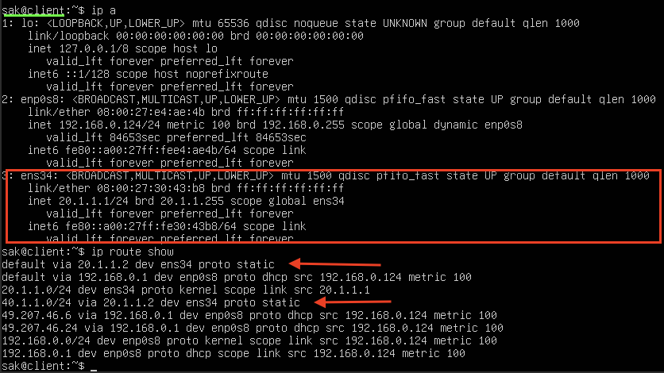
    port `ens34` has IP address `20.1.1.1/24` and default gateway `20.1.1.2`, with a route to `40.1.1.0/24` via `20.1.1.2`
    - VM2 - Gateway:
    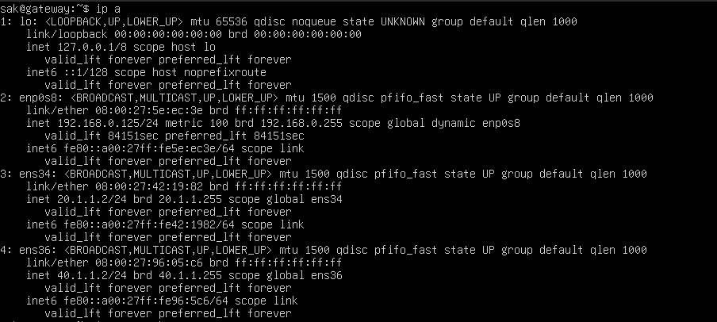
    port `ens34` has IP address `20.1.1.2/24` and port `ens36` has IP address `40.1.1.2` -- acting as a gateway for the networks `20.1.1.0/24` and `40.1.1.0/24` respectively.
    - VM3 - Server 1:
    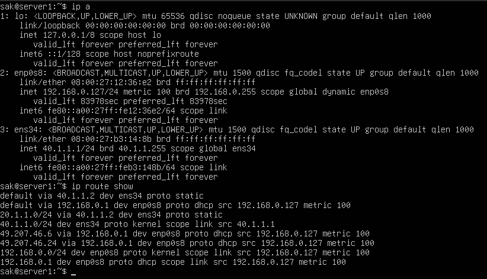
    port `ens34` has IP address `40.1.1.1/24` and default gateway `40.1.1.2`, with a route to `20.1.1.0/24` via `40.1.1.2`
    - VM4 - Server 2:
    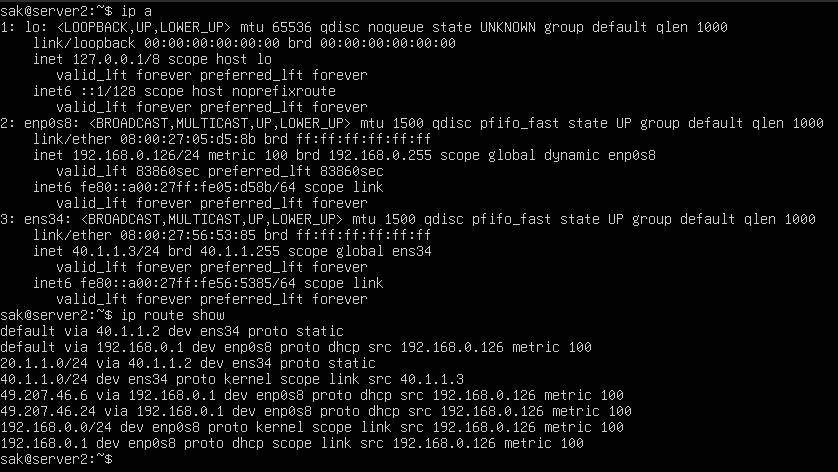
    port `ens34` has IP address `40.1.1.3/24` and default gateway `40.1.1.2`, with a route to `20.1.1.0/24` via `40.1.1.2`

    - Each VM has a port `enp0s8` which is a Bridged Adapter connected to the host network for internet access.
  
- I have configured VM2 as the gateway such that it can forward the incoming traffic to one of the servers using the following commands:
    ```bash
    sudo nano /etc/sysctl.conf
    ```
    then uncommented the following line:
    ```bash
    net.ipv4.ip_forward=1
    ```
    then applied the changes using the following command:
    ```bash
    sudo sysctl -p
    ```
    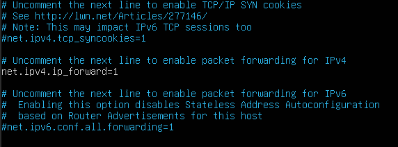

- The following can be verified using `ping` command from VM1 to VM3 and VM4:
    - VM1 to VM3:

        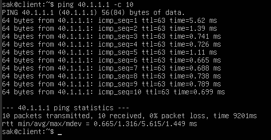
    - VM1 to VM4:
    
        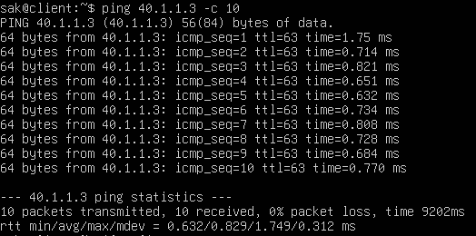
- The above results show that the configurations are correct and the traffic is being forwarded correctly.

## Q2 - Traffic filtering at the gateway VM
### Deliverables
- a) The gateway must block all traffic (except for ping) destined to the server `40.1.1.1/24`.Show that this works; attach the screenshot.
- b) The gateway must block only TCP traffic initiated by `20.1.1.1/24`. Show that this works; attach the screenshot.

### Methodology
- Using IPTables, I have configured the gateway VM to block all traffic (except for ping) destined to the server `40.1.1.1/24` using `OUTPUT` and `FORWARD` chain.
  -  The `OUTPUT` chain is used to filter packets that are being sent out of the local system. This chain is used when a packet that creates a new connection is being routed from the local system.
  -  The `FORWARD` chain is used to filter packets that are being routed through the local system. This chain is used when a packet that creates a new connection is being routed through the local system.
  - The following commands were used to configure the IPTables:
    ```bash
    sudo iptables -A FORWARD -d 40.1.1.1 -j DROP
    sudo iptables -A FORWARD -d 40.1.1.1 -p icmp --icmp-echo-request -j ACCEPT
    sudo iptables -A FORWARD -d 40.1.1.1 -p icmp --icmp-echo-reply -j ACCEPT

    sudo iptables -A OUTPUT -d 40.1.1.1 -j DROP
    sudo iptables -A OUTPUT -d 40.1.1.1 -p icmp --icmp-echo-request -j ACCEPT
    sudo iptables -A OUTPUT -d 40.1.1.1 -p icmp --icmp-echo-reply -j ACCEPT
    ```
    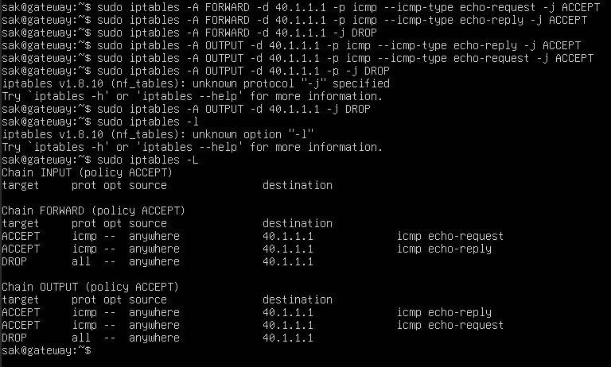
  - when using the `ping` command from VM1 to VM3 and VM2 to VM3:
    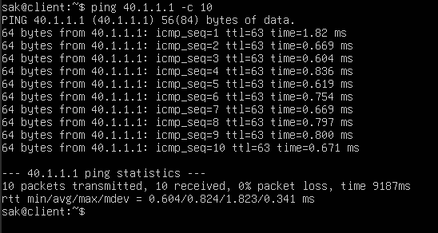
    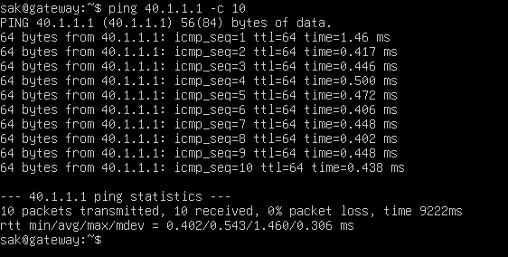

    packets are being transmitted and received correctly as requested.
  - but when using `nc` command (which uses TCP) to listen on port `8080` on VM3 and trying to connect to it from VM1 and VM2:
   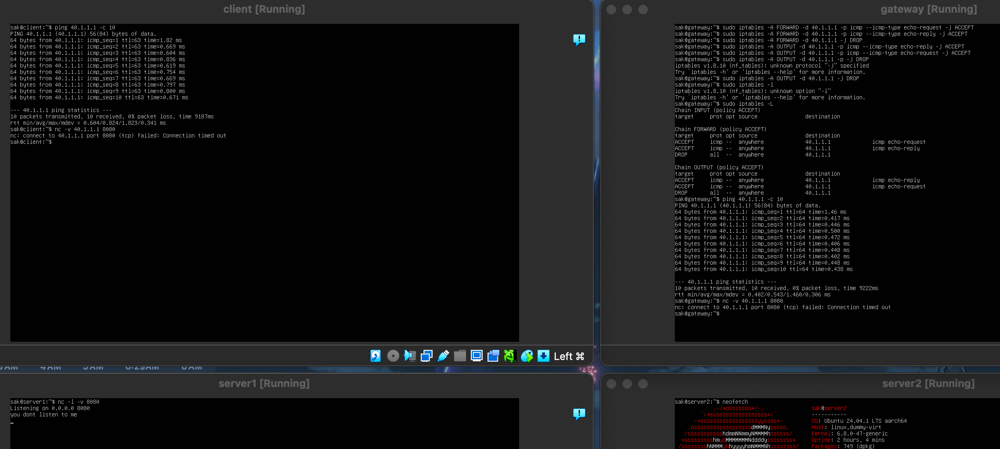
   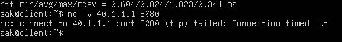
   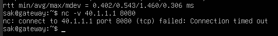
   

    the connection is not established as requested.
  - the same can be verified for UDP traffic using the `nc` command with option `-u`, it gives the same result as TCP traffic.
   
    
    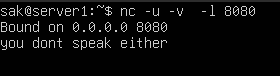

- I have configured the gateway VM to block only TCP traffic initiated by `20.1.1.1/24` using `INPUT` chain and `FORWARD` chain.
  - The `INPUT` chain is used to filter packets that are being sent to the local system. This chain is used when a packet that creates a new connection is being routed to the local system.
  - The following commands were used to configure the IPTables:
    ```bash
    sudo iptables -A INPUT -s 20.1.1.1 -p tcp -j DROP
    sudo iptables -A FORWARD -s 20.1.1.1 -p tcp -j DROP
    ```
    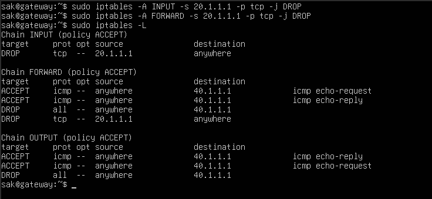
  - when using the `nc` command to listen on port `8080` on VM4 and trying to connect to it from VM1:
    
    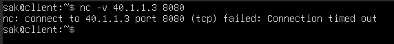
    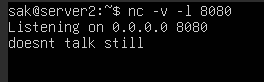
    
    thus blocking the TCP traffic.
  - the same can be verified for UDP traffic using the `nc` command with option `-u`, it is not blocked as requested.
    
    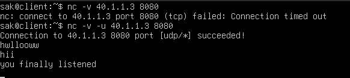
    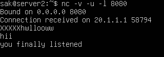

- The above results show that the configurations are correct and the traffic is being filtered correctly as requested.
  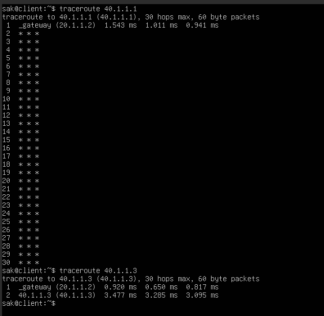
  as shown in the above image, the traffic is blocked by the gateway as seen by the `traceroute` command from VM1 to VM3. Even though it uses `icmp` packets, only ping packets are allowed, and the rest are blocked.
- The rules can be saved using
  ```bash
  sudo netfilter-persistent save
  ```
    and can be loaded using
    ```bash
    sudo netfilter-persistent reload
    ```
    to persist the rules even after a reboot.
- The rules can be flushed using
  ```bash
  sudo iptables -F
  ```
    to remove all the rules.

## Q3 - Use the configuration obtained in Q.2. to measure the performance of the gateway
### Deliverables
- a) Use “iperf2” tool to test the TCP and UDP bandwidth between 20.1.1.1/24 and
40.1.1.3/24. Attach the screenshot.
- b) What is the minimum, average, and maximum RTT (Attach the screenshot)
    - (i) from 20.1.1.1/24 to 40.1.1.1/24
    - (ii) from 20.1.1.1/24 to 40.1.1.3/24
    - (iii) Did you find a significant difference between (i) and (ii)? If so, why?

### Methodology
- I have used the `iperf2` tool to test the TCP and UDP bandwidth between the client `20.1.1.1/24` and the server `40.1.1.3` using the following commands:
  - TCP bandwidth:
    ```bash
    iperf -s
    ```
    on the server and
    ```bash
    iperf -c 40.1.1.3
    ```
    on the client.
    
    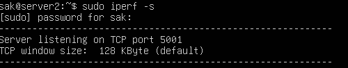
    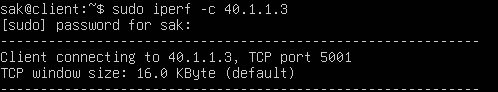
  - Since the TCP traffic is blocked for the client, the connection is not established, and no report is generated.
  
    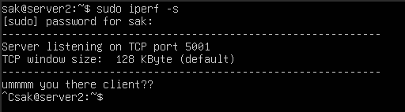
    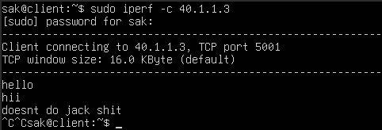

  - UDP bandwidth:
    ```bash
    iperf -s -u
    ```
    on the server and
    ```bash
    iperf -c 40.1.1.3 -u
    ```
    on the client.
  - The following results are obtained:
    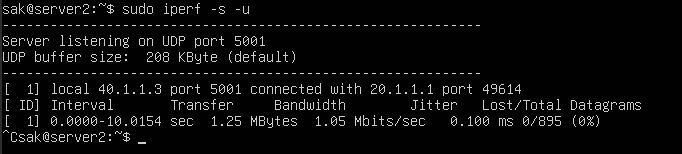
    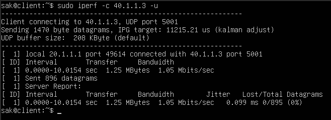
  - The above results show that the UDP traffic is not blocked and the bandwidth is measured correctly. The `iperf` tool sends `895` packets of size `1470` bytes each, in nearly `10` seconds, giving a transfer size of `1.24 MBytes` and a bandwidth of `1.05 Mbits/sec`.
- For measuring the RTT, I have used the `ping` command from the client to servers for `100` packets and then calculated the minimum, average, and maximum RTT.
  - from `20.1.1.1/24` to `40.1.1.1/24`:
    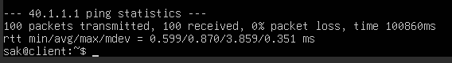

    min RTT : `0.599 ms`, avg RTT : `0.870 ms`, max RTT : `3.859 ms`, loss : `0%`
  - from `20.1.1.1/24` to `40.1.1.3/24`:
    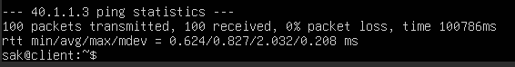

    min RTT : `0.624 ms`, avg RTT : `0.827 ms`, max RTT : `2.032 ms`, loss : `0%`
  - The above results show that there is no significant difference between the RTT of the two servers, as the RTT is nearly the same for both the servers. This is because the traffic is being forwarded correctly, and there are no rules to block `icmp` traffic between the client and the servers. And since both the servers are in the same network, and both are connected to the same gateway and one jump away, the RTT is nearly the same for both the servers.

## Q4 - Network address translation at the gateway VM 
### Deliverables
- a) Change the source IP address of every packet from 20.1.1.1/24 to 40.1.1.2/24
- b) When the packet response for the packet from step “a” arrives at the gateway, revert the destination IP address to the original.
- c) Validate the above by sending traffic and observing the packets at each VM using Wireshark/tcpdump. Attach the screenshot.
  
### Methodology
- I have used IPTables to configure the gateway VM to change the source IP address of every packet from `20.1.1.1/24` to `40.1.1.2/24` using the `POSTROUTING` chain.
  - The `POSTROUTING` chain is used to filter packets that are being sent out of the local system. This chain is used when a packet that creates a new connection is being routed from the local system.
  - The following commands were used to configure the IPTables:
    ```bash
    sudo iptables -t nat -A POSTROUTING -s 20.1.1.1 -j SNAT --to-source 40.1.1.2
    ```
- Now when the packet response for the packet from step “a” arrives at the gateway, the destination IP address is reverted to the original using the `PREROUTING` chain.
  - The `PREROUTING` chain is used to filter packets that are being routed through the local system. This chain is used when a packet that creates a new connection is being routed through the local system.
  - The following commands were used to configure the IPTables:
    ```bash
    sudo iptables -t nat -A PREROUTING -d 40.1.1.2 -j DNAT --to-destination 20.1.1.1
    ```
  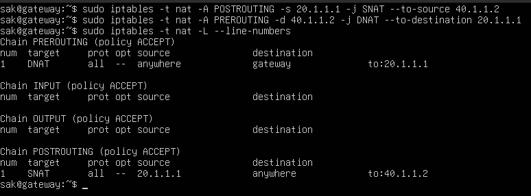

- Once these rules are applied, we can verify its working by running `tcpdump` on the client, server VMs and using a simple command like `ping` only.
  - on the client VM (for pinging from server2 to client):
      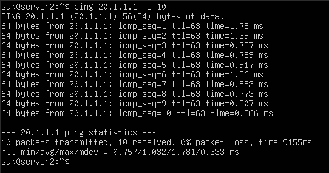
      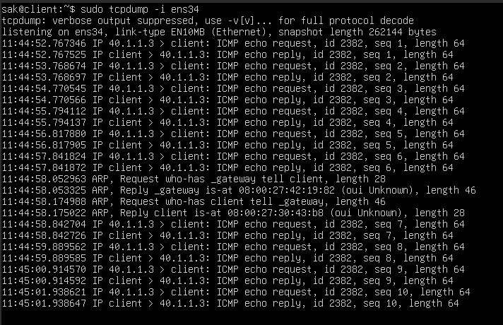
    when the packet is sent from server2 to the client, the IP address of the source and destination are not changed and `ping` command works as usual.
  - on the server2 VM (for pinging from client to server2):
      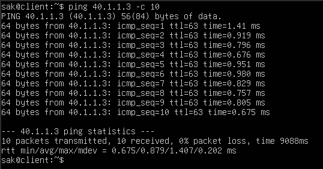
      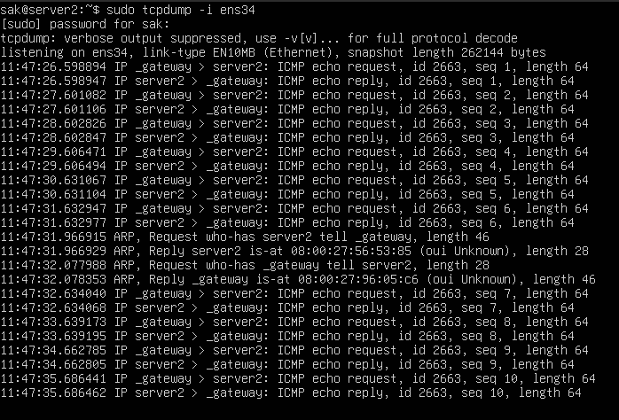
    but when the packet is sent from the client to server2, the IP address of the source is changed to `40.1.1.2 (_gateway)` and every echo reply packet has the destination IP address changed to `40.1.1.2 (_gateway)`. Even with these changes of destinations, the `ping` command works as usual with no loss of packets.
  - on the gateway VM (for pinging from client to server2):
    - for interface `ens34`:
      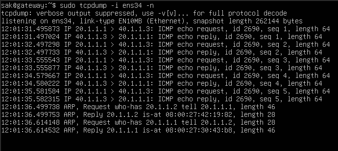
      the client side port of the gateway doesn't show any changes in the IP address of the packets.
    - for interface `ens36`:
      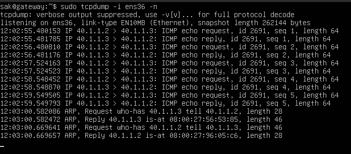
      the server side port of the gateway shows the changes in the IP address of the packets as expected. Hence all the changes and NAT process happens during the forwarding of the packets from the client to the server2 and is reverted back when the response is sent back to the client.
    - The IP address changes are done correctly and the packets are forwarded correctly, as seen by the `ping` command from the client to server2.
      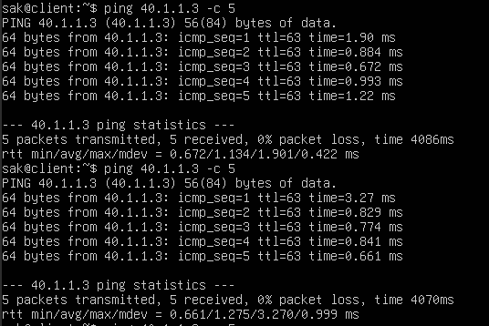
- The same results can be obtained using `tshark` command to capture the packets and analyze them, and they will be similar if communication is done using `nc` commmand or between client and server1.

## Q5 -  Load balancing at the gateway VM
### Deliverables
- a) Using the information obtained from Q.3.b., balance the traffic from 20.1.1.1/24 to the servers, 40.1.1.1/24 and 40.1.1.3/24. The probability of assigning the packet to the servers is 0.8 and 0.2, i.e., assign a high probability to the server with lower RTT.
- b) Test the above configuration using a series of “ping” packets.

### Methodology
- Using IP tables, load balancing can be achieved by using the `PREROUTING` chain and `DNAT` target to change the destination IP address of the packets. 
- The server2 is assigned a higher probability of `0.8` and server1 is assigned a lower probability of `0.2` as requested.
- The following commands were used to configure the IPTables:
  ```bash
  sudo iptables -t nat -A PREROUTING -s 20.1.1.1 -m statistic --mode random --probability 0.8 -j DNAT --to-destination 40.1.1.3
  sudo iptables -t nat -A PREROUTING -s 20.1.1.1 -j DNAT --to-destination 40.1.1.1
  ```
  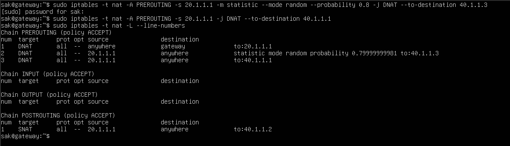

- Once these rules are applied, we can verify its working by running `tcpdump` on the server VMs and using `ping` commands on client VM.
- On the server VMs, run the command
  ```bash
  sudo tcpdump -i ens34 -n icmp and src host 40.1.1.2
  ```
  and on the client VM, run the command
  ```bash
  for i in {1..100}; do
    ping -c 1
  done
  ```
- The following results are obtained:
  - on server1 VM:
    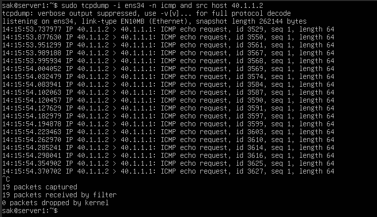
    the server1 receives only `19` packets out of `100` packets, which is around `0.2` probability as expected.
  - on server2 VM:
    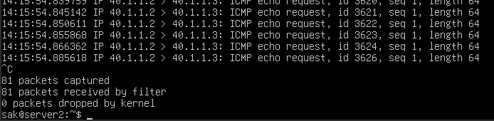
    the server2 receives `81` packets out of `100` packets, as expected.
  - The below table shows the packets received by each server for different trials.
     | Packets Sent | Server1 | Server2 |
     |--------------|---------|---------|
      | 100          | 19      | 81      |
      | 100          | 21      | 79      |
      | 100          | 17      | 83      |
      | 100          | 22      | 78      |
      | 100          | 18      | 82      |
      | 100          | 21      | 79      |
      | -            | -       | -       |
      | **Average**      | **19.6**    | **80.4**    |
  - The above results show that the load balancing is working correctly and the packets are being forwarded to the servers based on the probabilities assigned.

