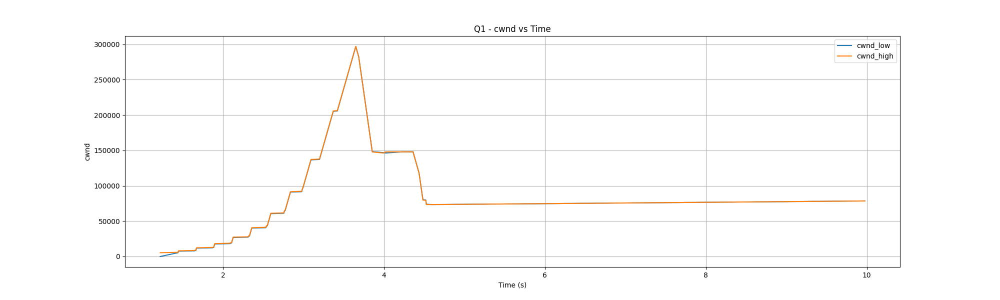

<h1 align="center">Network simulation and TCP congestion control analysis using ns3
</h1>
<p align="center">
  Saksham Singh
  <br>
  2022434
  <br>
  CSE 232 - Computer Networks - PA04
</p>

## Network Topology
- Three nodes are connected in a linear topology. The first node `n0` is connected to the second node `n1` and the second node is connected to the third node `n3`. 
- The link between the nodes is a point-to-point link, with node `n0` and `n1` connected with a link of `10Mbps` bandwidth and `100ms` delay. The link between node `n1` and `n2` is of `7Mbps` bandwidth and `10ms` delay.
- The queue size is set to `50` packets of size `1460` bytes, and error rate is set to `0.000001`. The TCP variant used is `TcpNewReno`, and the ns3 simulation time is set to `10s`.

```
         node 0                 node 1                node 2
   +----------------+    +----------------+    +----------------+
   |    ns-3 TCP    |    |    ns-3 TCP    |    |    ns-3 TCP    |
   +----------------+    +----------------+    +----------------+
   |    10.1.1.1    |   |10.1.1.2, 10.1.2.1|   |    10.1.2.2    |
   +----------------+    +----------------+    +----------------+
   | point-to-point |    | point-to-point |    | point-to-point |
   +----------------+    +----------------+    +----------------+
           |                     |                     |
           +---------------------+---------------------+
                10Mbps, 100ms         7Mbps, 10ms
```

## Q1 - Run the simulation with the default parameters (provided in the table) and answer the following questions
### a) What is the maximum expected value (theoretical) of throughput (in Mbps)? Why?
- The maximum theoretical throughtput can be `7Mbps` because the bottleneck link is between node `n1` and `n2` which has a bandwidth of `7Mbps`. The throughput of the network is limited by the bandwidth of the bottleneck link.

### b) How much is Bandwidth-Delay-Product (BDP)? Express your answer in terms of the number of packets.
- The Bandwidth-Delay-Product (BDP) is the maximum number of bits that can be in the network at any given time. It is calculated as the product of the bandwidth and the round-trip time (RTT) of the network. The RTT of the network is the sum of the delays of the links between the nodes. The BDP is calculated as:
  ```
  BDP = Bandwidth * RTT_Delay
  ```
  The RTT delay can be computed as the sum of propogation delays of the links between the nodes and the transmission delays of the packets. The propogation delay is the time taken for the packet to travel from the source to the destination, and the transmission delay is the time taken to transmit the packet over the link. The propogation delay for the two links is: `100ms + 10ms = 110ms`.
  The transmission delay can be calculated as the time taken to transmit a packet of size `1460` bytes over the link, defined as `Packet size / Maximum bandwidth = 1460 bytes / 7Mbps = 0.00166857 secs = 1.66857ms`. <br>
  Therefore, the transmission side of the RTT is `110ms + 1.66857ms = 111.66857ms`.<br>
  For the round trip, assuming the acknoledgement is sent immediately after the packet is received, and acknoledgement transmission delay is 0ms, the return trip time is just the propogation delay of the two links, which is `110ms`.<br>
  Therefore, the RTT is `111.66857ms + 110ms = 221.66857ms`.

- Calculating the Bandwidth-Delay-Product (BDP) as:
  ```
    BDP = 7Mbps * 221.66857ms = 7 * 10^6 * 221.66857 * 10^-3 = 1551680 bits = 193960 bytes
  ```
  The packet size is `1460` bytes,
  ```
    BDP = 193960 bytes / 1460 bytes = 132.8 packets
  ```
  Therefore, the Bandwidth-Delay-Product (BDP) is `132.8` packets.

- IF we assume that acknoledgement is not sent, BDP will be `7Mbps * 111.66857ms = 776679 bits = 97084 bytes = 66.4 packets`, roughly half of the previous value.

### c) What is the average computed throughput of the TCP transfer?
- Upon running the simulation and analyzing the `.pcap` files for all the nodes, we can calculate the sum of the bytes received and divide by the simulation time to get the average throughput. It can be acheived by running the following commmand:
  ```bash
  tshark -r {file} -q -z io,stat,10,"SUM(frame.len)frame.len"
  ```
  where `{file}` is the `.pcap` file for the node. The output will be as follows:
  ```
    ========================================
    | IO Statistics                        |
    |                                      |
    | Duration: {duration} secs            |
    | Interval: {duration} secs            |
    |                                      |
    | Col 1: SUM(frame.len)frame.len       |
    |--------------------------------------|
    |                     |1        |      |
    | Interval            |   SUM   |      |
    |-------------------------------|      |
    | 0.000 <> {duration} | {bytes} |      |
    ========================================
    ```
    The average throughput can be calculated as `bytes / duration`. 

- This can be automated using the following comands in python:
    ```python
    files = ["Q1_tcp-example-0-0.pcap", "Q1_tcp-example-1-0.pcap", "Q1_tcp-example-1-1.pcap", "Q1_tcp-example-2-0.pcap"]
    throughput = []

    for file in files:
        # Parse the pcap file for throughput
        command = f"tshark -r {file} -q -z io,stat,10,\"SUM(frame.len)frame.len\""
        output = os.popen(command).read()
        # print(output) 
        output = output.split()
        # print(output)
        frame_len = float(output[-4])
        duration = float(output[-6])
        throughput.append(frame_len * 8 / duration / 1000000)

    for i, file in enumerate(files):
        print(f"Throughput for {file} is {throughput[i]} Mbps")
    ```
    
- The following are the average throughputs for the nodes:
    ```
    Throughput for Q1_tcp-example-0-0.pcap is 3.2745145403899723 Mbps
    Throughput for Q1_tcp-example-1-0.pcap is 3.26832 Mbps
    Throughput for Q1_tcp-example-1-1.pcap is 3.2656683146067413 Mbps
    Throughput for Q1_tcp-example-2-0.pcap is 3.261553830577118 Mbps
    ```

### d. Is the achieved throughput approximately equal to the maximum expected value? If it is not, explain the reason for the difference.
- As we can see, the theoretical maximum throughput is `7Mbps`, but the achieved throughput is around `3.26Mbps`. The achieved throughput is less than the theoretical maximum throughput because of the following reasons:
  - The TCP congestion control algorithm used is `TcpNewReno`, which is a conservative algorithm that reduces the congestion window size by half upon detecting congestion. This reduces the throughput of the network.
  - The network has a queue size of `50` packets, which can cause packet loss due to buffer overflow. Packet loss can cause the TCP sender to reduce the congestion window size, which reduces the throughput of the network.
  - The error rate of the network is set to `0.000001`, which can cause packet loss due to bit errors. Packet loss can cause the TCP sender to reduce the congestion window size, which reduces the throughput of the network.
- These factors combined can reduce the throughput of the network from the theoretical maximum value.

### e. Plot Congestion Window (CWND) with time
- The congestion window (CNWD) can be plotted by parsing the `.cwnd` file generated using the ns3 simulation, and plotted using matplotlib. It can be done using the following python code:
    ```python
    import matplotlib.pyplot as plt

    with open("Q1_tcp-example.cwnd", "r") as f:
        time = []
        cwnd_low = []
        cwnd_high = []
        for line in f:
            fields = line.strip().split()
            time.append(float(fields[0]))
            cwnd_low.append(float(fields[1]))
            cwnd_high.append(float(fields[2]))


    # Plot the cwnd
    plt.figure(figsize=(20, 6))
    plt.plot(time, cwnd_low, label="cwnd_low")
    plt.plot(time, cwnd_high, label="cwnd_high")
    plt.xlabel("Time (s)")
    plt.ylabel("cwnd")
    plt.title("Q1 - cwnd vs Time")
    plt.legend()
    plt.grid()
    plt.savefig("Q1_cwnd.png")
    plt.show()
    ```
- The plot will be saved as `Q1_cwnd.png` and will look like the following:
    

### f. Plot queueing delay with time
- The queueing delay can be plotted by parsing the trace file generated using the ns3 simulation, and plotted using matplotlib. It can be done using the following python code:
    ```python
    import matplotlib.pyplot as plt

    time = []
    queuing_delay = []
    enqueued_times = {}

    # Parse the trace file for queuing delay -- format as below
    # + time 
    # - time
    # r time

    for line in open(trace_file):
        fields = line.strip().split()
        event = fields[0]
        timestamp = float(fields[1])
        node_id = fields[2]
        packet_info = " ".join(fields[3:])

        if event == "+":
            key = packet_info
            enqueued_times[key] = timestamp
        elif event == "-":
            key = packet_info
            if key in enqueued_times:
                delay = timestamp - enqueued_times[key]
                time.append(timestamp)
                queuing_delay.append(delay)
                del enqueued_times[key]

    # save the data to a file
    with open("Q1_QueingDelay.txt", "w") as f:
        for i in range(len(time)):
            f.write(f"{time[i]} {queuing_delay[i]}\n")

    # Plot the queuing delay
    plt.figure(figsize=(20, 6))
    plt.plot(time, queuing_delay)
    plt.xlabel("Time (s)")
    plt.ylabel("Queuing Delay (s)")
    plt.title("Q1 - Queuing Delay vs Time")
    plt.grid()
    plt.savefig("Q1_QueingDelay.png")
    plt.show()
    ```
- The plot will be saved as `Q1_QueingDelay.png` and will look like the following:
    

- Similarly, the queuing length can be plotted using the following python code:
    ```python
    import matplotlib.pyplot as plt

    time = []
    queuing_length = []
    enqueued_packets = {}

    # Parse the trace file for queuing length -- format as below
    # + time
    # - time
    # r time

    for line in open(trace_file):
        fields = line.strip().split()
        event = fields[0]
        timestamp = float(fields[1])
        node_id = fields[2]
        packet_info = " ".join(fields[3:])

        if event == "+":
            key = packet_info
            enqueued_packets[key] = timestamp
        elif event == "-":
            key = packet_info
            if key in enqueued_packets:
                time.append(timestamp)
                queuing_length.append(len(enqueued_packets))
                del enqueued_packets[key]

    # save the data to a file
    with open("Q1_QueingLength.txt", "w") as f:
        for i in range(len(time)):
            f.write(f"{time[i]} {queuing_length[i]}\n")

    # Plot the queuing delay
    plt.figure(figsize=(20, 6))
    plt.plot(time, queuing_length)
    plt.xlabel("Time (s)")
    plt.ylabel("Queuing Length")
    plt.title("Q1 - Queuing Length vs Time")
    plt.grid()
    plt.savefig("Q1_QueingLength.png")
    plt.show()
    ```
- The plot will be saved as `Q1_QueingLength.png` and will look like the following:
    

### g) Are the plots in 1(e) and 1(f) related? Explain the relationship between the two plots.
- The plots in 1(e) and 1(f) are related because the queuing delay is related to the congestion window size. When the congestion window size is small, the packets are sent slowly, which reduces the queuing delay. When the congestion window size is large, the packets are sent quickly, which increases the queuing delay. Therefore, the queuing delay is proportional to the congestion window size, and the two plots are related.

## Q2 - Change queue size to 1000 (rest of the parameter values are same as default values)
### a) What is the average computed throughput of the TCP transfer?
- The average throughput values are:
  ```
  Throughput for Q2_tcp-example-0-0.pcap is 4.808675642594859 Mbps
  Throughput for Q2_tcp-example-1-0.pcap is 4.833663108214406 Mbps
  Throughput for Q2_tcp-example-1-1.pcap is 4.833663108214406 Mbps
  Throughput for Q2_tcp-example-2-0.pcap is 4.835047361907977 Mbps
  ```

### b) Plot CWND with time
- The plot will be saved as `Q2_cwnd.png` and will look like the following:
    

### c) Plot queueing delay with time
- The plot will be saved as `Q2_QueingDelay.png` and will look like the following:
    
- The queueing length plot will be saved as `Q2_QueingLength.png` and will look like the following:
    

### d) Compare CWND plots of Q.1. and Q.2.; what insights did you gain?
- The CWND plot for Q1 and Q2 are as follows:
    
    
- Since the queue size is increased to `1000` packets in Q2, the congestion window size is larger in Q2 compared to Q1. The larger congestion window size allows more packets to be sent in the network, which increases the throughput of the network. Therefore, the throughput of the network is higher in Q2 compared to Q1.

## Q3 - Change N1-N2 bandwidth to 10 Mbps and N1-N2 delay to 100ms (rest of the parameter values are same as default values)
### a) What is the average computed throughput of the TCP transfer?
- The average throughput values are:
  ```
  Throughput for Q3_tcp-example-0-0.pcap is 3.419889777777778 Mbps
  Throughput for Q3_tcp-example-1-0.pcap is 3.378456006292842 Mbps
  Throughput for Q3_tcp-example-1-1.pcap is 3.378456006292842 Mbps
  Throughput for Q3_tcp-example-2-0.pcap is 3.4509745237548772 Mbps
  ```

### b) Plot CWND with time
- The plot will be saved as `Q3_cwnd.png` and will look like the following:
    

### c) Plot queueing delay with time
- The plot will be saved as `Q3_QueingDelay.png` and will look like the following:
    
- The queueing length plot will be saved as `Q3_QueingLength.png` and will look like the following:
    

### d) Compare queuing delay plots of Q.1. and Q.3.; what insights did you gain?
- The queuing delay plot for Q1 and Q3 are as follows:
    
    

- The queuing delay is higher in Q1 compared to Q3 as the packets are sent more slowly in Q1 due to the lower bandwidth of the link between node `n1` and `n2`. The higher bandwidth of the second link in Q3 allows more packets to be sent in the network, which reduces the queuing delay in the network.
- We also see that the queuing delay takes longer to saturate in Q3 compared to Q1, which is due to the higher bandwidth of the link between node `n1` and `n2`.

